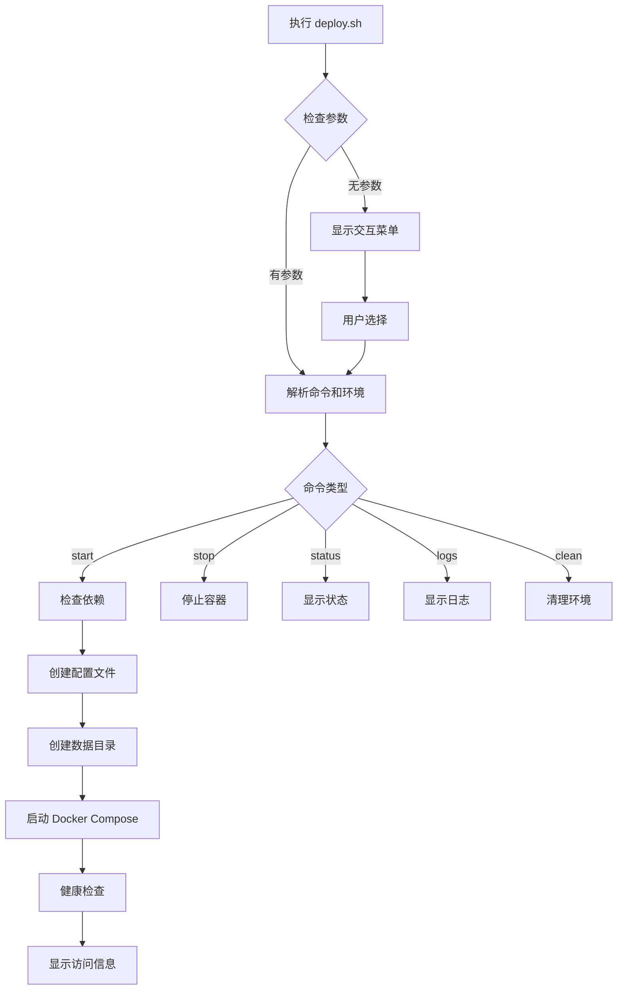

# 部署脚本使用指南

本文档详细介绍 metasfresh 一键部署脚本 `deploy.sh` 的使用方法。

---

## 📋 脚本概述

`deploy.sh` 是一个强大的一键部署工具，支持：
- ✅ 多环境管理（dev/test/prod/infra）
- ✅ 自动配置生成
- ✅ 服务健康检查
- ✅ 日志查看和管理
- ✅ 数据目录管理

**脚本位置：**
```bash
./scripts/deploy.sh
# 或
./deploy.sh  # 根目录软链接
```

---

##使用方法

### 基本语法

```bash
./deploy.sh <command> <environment>
```

### 支持的命令

| 命令 | 说明 | 示例 |
|------|------|------|
| `start` | 启动服务 | `./deploy.sh start dev` |
| `stop` | 停止服务 | `./deploy.sh stop dev` |
| `restart` | 重启服务 | `./deploy.sh restart dev` |
| `status` | 查看状态 | `./deploy.sh status dev` |
| `logs` | 查看日志 | `./deploy.sh logs dev` |
| `clean` | 清理环境 | `./deploy.sh clean dev` |

### 支持的环境

| 环境 | 说明 | 端口 |
|------|------|------|
| `dev` | 开发环境 | 8080 |
| `test` | 测试环境 | 8081 |
| `prod` | 生产环境 | 8080 |
| `infra` | 仅基础设施 | - |

---

## 🚀 快速开始

### 1. 交互式启动（推荐新手）

```bash
./deploy.sh
```

会显示菜单：
```
╔═══════════════════════════════════════════════════════════╗
║                                                           ║
║        metasfresh ERP 一键部署脚本                        ║
║        Multi-Environment Deployment Tool                  ║
║                                                           ║
╚═══════════════════════════════════════════════════════════╝

请选择部署环境:
  1) 开发环境 (Development)  - 端口 8080
  2) 测试环境 (Testing)      - 端口 8081
  3) 生产环境 (Production)   - 端口 8080
  4) 仅基础设施 (Infra Only) - 只启动数据库等

请输入选项 [1-4]: 1
```

### 2. 命令行启动（推荐熟练用户）

```bash
# 启动开发环境
./deploy.sh start dev

# 启动测试环境
./deploy.sh start test

# 启动生产环境
./deploy.sh start prod

# 仅启动基础设施
./deploy.sh start infra
```

---

## 📊 环境详细配置

### 开发环境 (dev)

```bash
./deploy.sh start dev
```

**配置特点：**
- 端口：8080, 80, 8880
- 调试端口：8789 (WebAPI), 8788 (App)
- JVM 内存：512M (WebAPI), 1G (App)
- 日志级别：DEBUG
- 数据目录：`data/dev/`

**自动生成的文件：**
- `.env.dev` - 环境变量
- `docker-compose.dev.yml` - Compose 配置

### 测试环境 (test)

```bash
./deploy.sh start test
```

**配置特点：**
- 端口：8081, 81, 8881
- 无调试端口
- JVM 内存：768M (WebAPI), 1.5G (App)
- 日志级别：INFO
- 数据目录：`data/test/`

### 生产环境 (prod)

```bash
./deploy.sh start prod
```

**配置特点：**
- 端口：8080, 80, 8880
- 无调试端口
- JVM 内存：2G (WebAPI), 4G (App)
- 日志级别：WARN
- 数据目录：`data/prod/`
- 严格健康检查

### 基础设施 (infra)

```bash
./deploy.sh start infra
```

**包含服务：**
- PostgreSQL (5432)
- RabbitMQ (5672, 15672)
- Elasticsearch (9200, 9300)

**适用场景：**
- 本地开发时只需数据库等基础服务
- 前后端分离开发
- 测试基础设施连接

---

## 🔍 服务管理

### 查看服务状态

```bash
./deploy.sh status dev
```

**输出示例：**
```
╔═══════════════════════════════════════════════════════════╗
║              dev 环境服务状态                              ║
╚═══════════════════════════════════════════════════════════╝

NAME                          STATUS          PORTS
metasfresh-dev-db             Up (healthy)    0.0.0.0:15432->5432/tcp
metasfresh-dev-rabbitmq       Up (healthy)    0.0.0.0:5672->5672/tcp, 0.0.0.0:15672->15672/tcp
metasfresh-dev-es             Up (healthy)    0.0.0.0:9200->9200/tcp
metasfresh-dev-webapi         Up (healthy)    0.0.0.0:8080->8080/tcp
metasfresh-dev-app            Up (healthy)    0.0.0.0:8282->8282/tcp
metasfresh-dev-webui          Up (healthy)    0.0.0.0:80->80/tcp
```

### 查看实时日志

```bash
# 所有服务日志
./deploy.sh logs dev

# 只看最近 100 行
./deploy.sh logs dev --tail=100

# 实时跟踪（Ctrl+C 退出）
./deploy.sh logs dev -f
```

### 重启服务

```bash
# 重启所有服务
./deploy.sh restart dev

# 等效于
./deploy.sh stop dev
./deploy.sh start dev
```

### 停止服务

```bash
# 停止服务（保留数据）
./deploy.sh stop dev
```

### 清理环境

```bash
# ⚠️ 警告：会删除所有数据！
./deploy.sh clean dev
```

**确认提示：**
```
⚠️  警告：此操作将删除以下内容：
  - 所有容器
  - 所有数据（数据库、消息队列、日志等）
  - Docker Compose 配置文件

确定要清理 dev 环境吗? (yes/no): yes
```

---

## ⚙️ 高级用法

### 自定义环境变量

创建自定义配置文件：

```bash
# 复制现有配置
cp docker-builds/compose/.env.dev docker-builds/compose/.env.custom

# 修改配置
vim docker-builds/compose/.env.custom

# 使用自定义配置启动
cd docker-builds/compose
docker compose --env-file .env.custom up -d
```

### 选择性启动服务

```bash
cd docker-builds/compose

# 只启动数据库
docker compose -f docker-compose.infra.yml up -d db

# 只启动 RabbitMQ
docker compose -f docker-compose.infra.yml up -d rabbitmq

# 启动 WebAPI 和依赖
docker compose -f docker-compose.dev.yml up -d webapi
```

### 查看生成的配置

```bash
# 环境变量文件
cat docker-builds/compose/.env.dev

# Docker Compose 配置
cat docker-builds/compose/docker-compose.dev.yml

# 验证配置（不启动）
cd docker-builds/compose
docker compose -f docker-compose.dev.yml config
```

---

## 📁 数据目录结构

脚本会自动创建以下目录结构：

```
docker-builds/compose/data/
├── dev/
│   ├── postgres/           # PostgreSQL 数据文件
│   ├── rabbitmq/           # RabbitMQ 数据文件
│   ├── elasticsearch/      # Elasticsearch 索引
│   └── logs/
│       ├── webapi/         # WebAPI 日志
│       └── app/            # App Server 日志
├── test/
│   └── ...
├── prod/
│   └── ...
└── infra/
    └── ...
```

---

## 🔧 故障排除

### 问题 1: 脚本无执行权限

```bash
# 添加执行权限
chmod +x scripts/deploy.sh

# 或使用绝对路径
/bin/bash scripts/deploy.sh start dev
```

### 问题 2: Docker 未运行

```bash
# 检查 Docker 状态
docker info

# macOS: 启动 Docker Desktop
open -a Docker

# Linux: 启动 Docker 服务
sudo systemctl start docker
```

### 问题 3: 端口被占用

```bash
# 查找占用进程
lsof -i :8080

# 修改端口（编辑 .env 文件）
vim docker-builds/compose/.env.dev
# 修改 WEBAPI_PORT=18080

# 重新启动
./deploy.sh restart dev
```

### 问题 4: 服务启动失败

```bash
# 查看详细日志
docker logs metasfresh-dev-webapi

# 检查健康状态
docker inspect --format='{{.State.Health}}' metasfresh-dev-webapi

# 重新创建容器
cd docker-builds/compose
docker compose -f docker-compose.dev.yml up -d --force-recreate webapi
```

### 问题 5: 数据丢失

```bash
# 检查数据目录
ls -la docker-builds/compose/data/dev/

# 从备份恢复
./deploy.sh clean dev
# 复制备份数据到 data/dev/
cp -r backup/data/dev/* docker-builds/compose/data/dev/
./deploy.sh start dev
```

---

## 💡 最佳实践

### 1. 环境隔离

```bash
# 不同环境使用不同端口和数据目录
# dev: 8080, data/dev/
# test: 8081, data/test/
# prod: 8080, data/prod/

# 可以同时运行多个环境
./deploy.sh start dev
./deploy.sh start test
```

### 2. 定期备份

```bash
#!/bin/bash
# backup.sh

ENV=prod
BACKUP_DIR=/backup/metasfresh/$(date +%Y%m%d)

# 创建备份目录
mkdir -p $BACKUP_DIR

# 备份数据目录
tar -czf $BACKUP_DIR/data.tar.gz docker-builds/compose/data/$ENV/

# 备份数据库
docker exec metasfresh-$ENV-db pg_dump -U metasfresh metasfresh > $BACKUP_DIR/db.sql

echo "备份完成: $BACKUP_DIR"
```

### 3. 健康检查

```bash
#!/bin/bash
# health-check.sh

ENV=${1:-dev}

# 检查所有服务健康状态
docker ps --filter "name=metasfresh-$ENV" --format "table {{.Names}}\t{{.Status}}" | grep -v "healthy" && echo "有服务不健康！" || echo "所有服务正常"

# 检查端口
nc -zv localhost 8080 && echo "WebAPI 端口正常" || echo "WebAPI 端口异常"
```

### 4. 日志轮转

```bash
# 配置 Docker 日志轮转
# 编辑 /etc/docker/daemon.json
{
  "log-driver": "json-file",
  "log-opts": {
    "max-size": "10m",
    "max-file": "3"
  }
}

# 重启 Docker
sudo systemctl restart docker
```

---

## 📊 脚本工作流程



---

## 📚 相关文档

- [Docker 部署](../06-deployment/01-docker-deployment.md)
- [环境配置](../06-deployment/03-environment-config.md)
- [命令速查](./04-command-reference.md)

---

**更新时间：** 2024-12-07  
**维护者：** metasfresh DevOps Team
